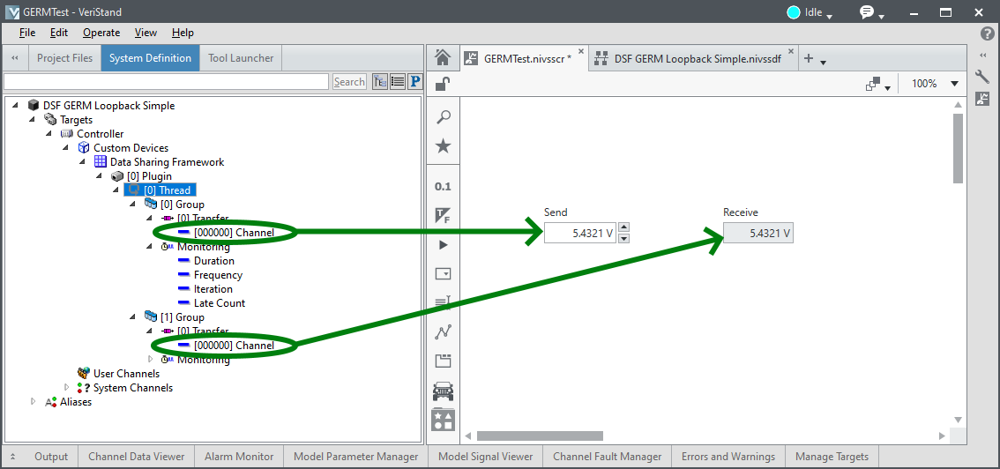
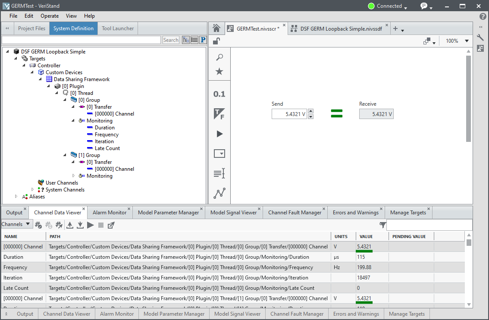

# Getting Started with the GE Reflective Memory Component
The GE Reflective Memory plugin component for the Data Sharing Framework Custom Device for VeriStand implements a point-to-point communication mechanism that allows sharing of data buffers between PXI GE Reflective Memory devices (5565PIORC) in a real-time measurement and control system. 

Use this document to create a new data sharing framework custom device that leverages the GE Reflective Memory plugin component to perform simple loopback communication.

## Prerequisites
Before starting this exercise, install the following software:

- VeriStand
- Data Sharing Framework ([DSF Releases](https://github.com/ni/niveristand-data-sharing-framework-custom-device/releases))
- Data Sharing Framework Plugins ([DSF Plugins Releases](https://github.com/ni/niveristand-data-sharing-framework-custom-device-plugins/releases))
- RT driver support for the GE Reflective Memory device
   - **_Incompatibility_**: The GE Reflective Memory driver for this custom device is incompatible with the GE Fanuc driver installed through MAX, which is used by VeriStand's built-in reflective memory support. You must uninstall the GE Fanuc driver from the RT target before continuing.
   - Locate the GE5565PIORC_NetworkInterrupts_DMA.inf file on disk. The .inf file is installed by the NI Package for this component and can be found on disk at the file path below:
   ```
   <Public Documents>\National Instruments\NI VeriStand 20xx\Custom Devices\Data Sharing Framework\Windows\Components
   ```
   - Right-click on the RT target in MAX and select **File Transfer**. Copy the .inf file to the RT target at c:/ni-rt/system/. Reboot the RT target to take effect.

   

## Connect to the Remote System
Identify and connect to the remote system using NI-MAX. Take note of the IP address of the remote system. For this loopback exercise, a single GE Reflective Memory device will both send and receive data.

## Create a VeriStand Project
1. Open VeriStand
1. Create a New Project
1. Open the System Explorer
1. Under `<Project>/Targets`
   - Select 'Controller'
      - Verify **Operating System** = 'Windows'
      - Verify **IP Address** = 'localhost'
      - Note **Target Rate** = 100 Hz
1. Under `<Project>/Targets/Controller/Hardware, right click on 'Custom Devices'`
   - Select 'Data Sharing Framework' from the popup menu

*Note*: Only one instance of the Data Sharing Framework Custom Device can be deployed per target.

## Configure the Custom Device
1. Select the newly created 'Data Sharing Framework' Custom Device
1. Because we are starting from scratch, select **New...** which launches a dialog that enables you to manually configure the custom device by directly setting the values in the DSF configuration cluster.
   - Enter "GE Reflective Memory" in the first element of the components array
      - **Thread(0).transfer groups(0)**
         - Verify **core.direction** = "Tx"
         - Note that the channels array is configured to include a single numeric element
            - **engine data type** = "DBL" and should not be changed.
            - **string data type**= "DBL" and may be set to any datatype wide enough to hold the data value to transfer
            

       - **Thread(0).transfer groups(1)** _(Navigate to index 1 using the horizontal scrollbar for the **threads** array)_
          - Verify **core.direction** = "Rx"
         - Note that the channels array is configured to include a single numeric element
            - **engine data type** = "DBL" and should not be changed.
            - **string data type** = "DBL" and should be configured exactly the same as the 'Tx' transfer.
            
            
    - Press **Apply** to save your new configuration
    - Close the dialog
1. In the configuration tree, under "[0] Plugin", select "[0] Thread". In the configuration page:
   - Select "GE Reflective Memory" in **Components** listbox
   - Set **VISA Resource** to the **VISA Resource Name** as displayed in NI-MAX when the GE Reflective Memory Card is selected
   - No other configuration needs to be modified for this exercise.
1. Save the System Definition
1. Close the System Explorer
1. Add a new 'Screen'
1. Expand the System Definition tree and add the VeriStand channels for the configured transfers

1. Deploy the project
1. Once Connected, verify that changing the value of the *send* transfer channel value updates the value of the *receive* transfer channel value

